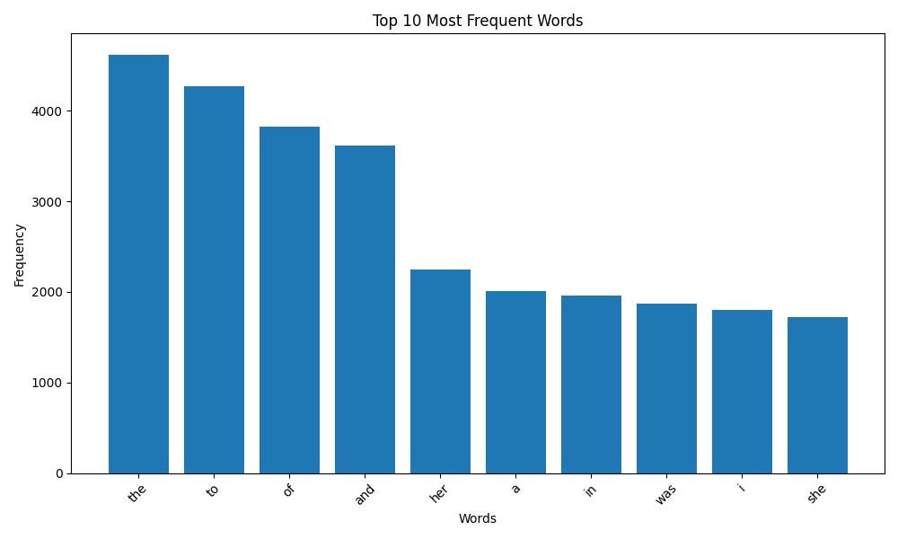

# woolf-algo2-hw-06

# Домашнє завдання 6 — Основи паралельних обчислень і модель MapReduce

## Мета

Реалізувати аналіз частоти слів у тексті, використовуючи парадигму **MapReduce** з підтримкою **паралельного обчислення**, а також **візуалізувати** результати у вигляді графіка.

---

## Технології

- Python 3.10+
- multiprocessing
- collections.Counter
- matplotlib
- requests

---

## Структура проєкту
```
woolf-algo2-hw-06/
├── mapreduce_wordcount.py
├── requirements.txt
├── README.md
└── screenshots/
    └── Figure_1_word_frequency_mapreduce.png
```

---

## Опис реалізації

1. **Текст** завантажується з URL (Project Gutenberg).
2. **MapReduce** реалізовано за допомогою `multiprocessing.Pool`.
3. Слова очищуються від пунктуації та зводяться до нижнього регістру.
4. Застосовується **mapper()** для підрахунку частот у кожному фрагменті.
5. Усі часткові підрахунки об’єднуються через **reducer()**.
6. Топ 10 найчастіших слів виводяться у вигляді **стовпчикової діаграми**.

---

## Результат візуалізації

> Частота 10 найпопулярніших слів у тексті



---

## Як запустити

1. Створи віртуальне середовище:

`python -m venv venv`
`source venv/bin/activate`  # для Linux/macOS
`venv\Scripts\activate`   # для Windows

## Встанови залежності:

`install -r requirements.txt`

## Запусти скрипт:

`python mapreduce_wordcount.py`

## Джерело тексту

Текст узятий з Project Gutenberg — "Pride and Prejudice" by Jane Austen.